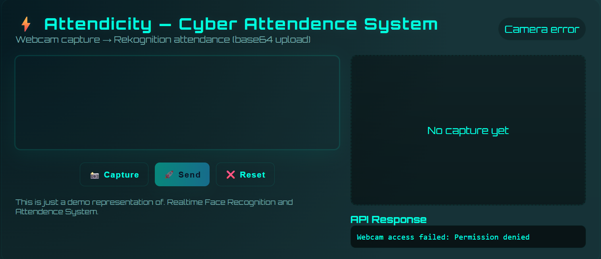

# 🚀 Serverless Attendence System using AWS 

------

# ⚡ Attendicity

A serverless **face-based attendance system** built with:

- **Frontend**: Pure HTML/CSS/JS (futuristic UI, responsive, with webcam capture)
- **Backend**: AWS Lambda + API Gateway + Rekognition + DynamoDB
- **Storage**: Amazon S3 for face datasets

---

## 🚀 Features
- **Landing Page** introducing Attendicity
- **Webcam Integration** (capture face directly from browser)
- **Serverless Backend** with AWS Lambda & API Gateway
- **Face Recognition** powered by Amazon Rekognition
- **Attendance Logging** in DynamoDB
- **Responsive, Futuristic UI** with animations
- **Easy File Configs** frontend (no build tools required)

---

🎥 How It Works  

- Landing Page → Click Try it out. 
- Start Camera → Allow webcam access. 
- Capture → Grab a snapshot from the live video feed. 
- Send → Image (Base64) is POSTed to Lambda via API Gateway. 
- Lambda → Uses Rekognition to match the face, logs presence in DynamoDB. 
- Response → UI displays Attendance marked or Face not recognized. 
---

How to setup locally
2. Backend Setup (AWS) 
Create S3 bucket (e.g. attendence-intern-project) and upload training images in faces/. 

Create Rekognition Collection: 
aws rekognition create-collection --collection-id AttendicityCollection --region ap-south-1 

Create DynamoDB Table named Attendance with userId as primary key. 
Create a Lambda Function (MarkAttendance) using Node.js 20.x runtime. 
Attach an IAM role with Rekognition, DynamoDB, S3 permissions. 
Deploy the index.js (provided in lambda/) as the handler. 
Create an API Gateway (HTTP API): 
Integration: Lambda → MarkAttendance 
Route: POST /MarkAttendence 
Enable CORS (* origins, OPTIONS, POST methods, Content-Type, Authorization headers) 
Deploy stage (e.g. dev) 

3. Frontend Setup 
Edit index.html and replace the API_URL constant: 
const API_URL = "https://your-api-id.execute-api.ap-south-1.amazonaws.com/dev/MarkAttendence"; 
Serve the file locally (to avoid file:// CORS issues). 
# Use Live Server in VSCode 
---

📬 Contact ME 
Feel free to connect or collaborate: 

📝 License 
This project is open source and free to use — feel free to fork, reference, or build on top of it! 
 
Let me know if you’d like to add badges (like GitHub stars, last commit, etc.) or dark mode screenshots! 
